---

## Currently

| Focus        | Details                                        |
|:----------|:--------------------------------------------------|
| Building  | models based project in python language           |
| Learning  | data analysis with `NumPy` and `pandas`           |
| Exploring | computer vision with `MediaPipe` and `OpenCV`     |
| Aiming    | developer roles with a computer vision focus      |

---

## Selected Projects

| Project | What it does |
|:--------|:-------------|
| [**Wellness Tracker**](https://github.com/princyy7/wellness-tracker) | tracks users healthy choices and recommends possible improvements |
| [**Shape Recognition**](https://github.com/princyy7/gesture-shape-recognition) | detects hand movement through a webcam and identifies the shape being shown |
| [**Gesture 3D Engine**](https://github.com/princyy7/gesture-3d-engine) | controls a 3D scene with hand gestures through a webcam |

---

## Tech Stack

| Area               | Tools                                   |
|:-------------------|:----------------------------------------|
| Languages          | [ Python · SQL ]                        |
| ML / Deep Learning | [ scikit-learn · PyTorch · TensorFlow ] |
| Data               | [ pandas · NumPy · Matplotlib ]         |
| GenAI / LLMs       | [ LangChain · Hugging Face · APIs ]     |
| Workflow           | [ Git · VS Code ]                       |

---
